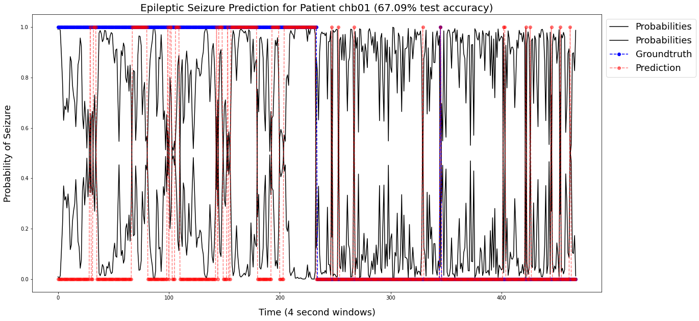
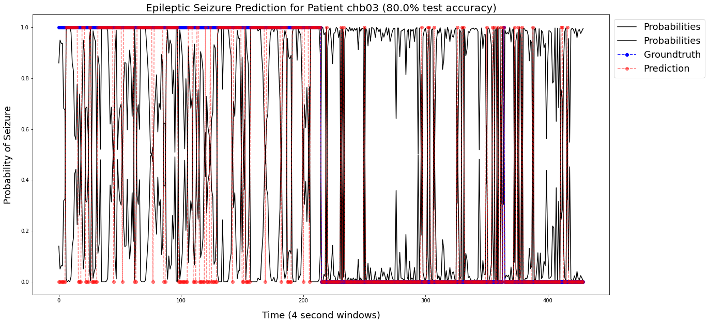
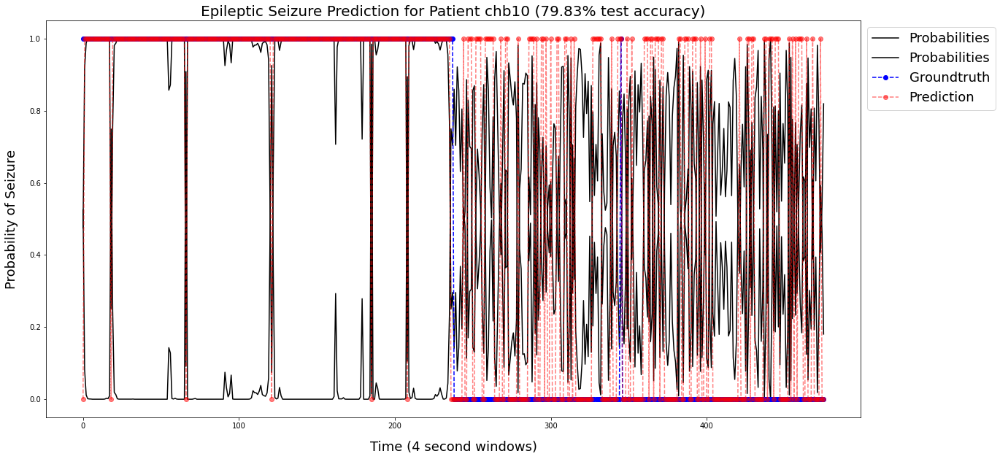

# Epileptic Seizure Prediction with EEG Data and Logistic Regression in Python 🧠 🐍

---

## Project Overview







The purpose of this task is to get familiar with some techniques for analyzing EEG signals with Python.

**Goal:** Predict whether or not a segment of data (a 4-second window) from an EEG corresponds to a seizure or not.

Our analysis will broadly consist of 4 main steps:

1. Read Data

2. Split Data into Train/Test Sets

3. Estimate Model Parameters

4. Plot Predictions and Compare with Groundtruth Values

## Data

For this task, the data comes from the "Physionet" database collected by the Children's Hospital of Boston. 

The data consits of EEG recordings gathered from 10 children and young adults with medically resistant epilepsy.

For access to the specific `input` EEG data, download the file from this [link](https://drive.google.com/file/d/1ZUe5ZUXNt7gOXeeghL2w8iVTelE-gV1i/view) and place the `eeg_data_temples2_sample.h5` file in your `input/` folder.

## How to Run

After cloning this repo locally and downloading the data, be sure to install the dependencies with the following command:

```bash
pip install --upgrade -r requirements.txt
```

Then, enter the notebook and run each cell.

## Credits

In Spring 2020, UC San Diego organized a 15 week mentorship experience, supported by an [ExploreCSR](https://explorecsr.eng.ucsd.edu/) (Explore Computer Science Research) grant from Google, to provide computer science research exposure to local community college students.

My research project, as presented in this repo, was supervised by [Anthony Thomas](https://github.com/thomas9t), my ExploreCSR Ph.D. student mentor from Spring 2020.